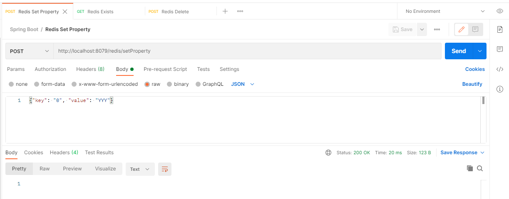
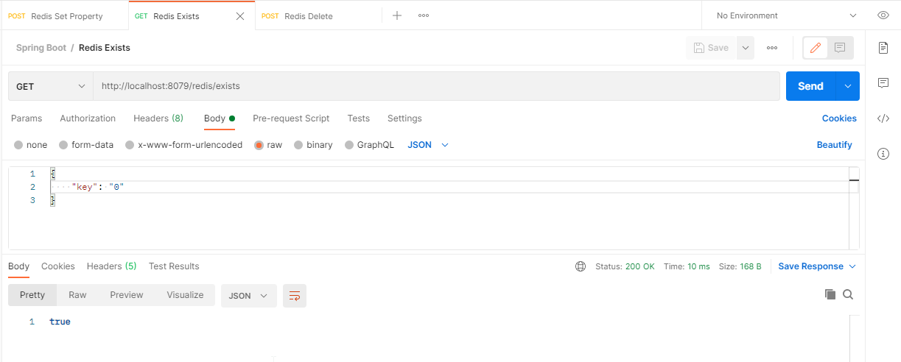
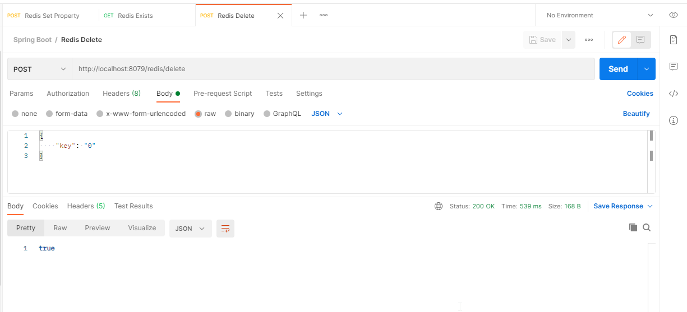

# SPRING BOOT REDIS

## Synopsis

The project is a Spring Boot Application using REDIS. 

## Motivation

I wanted to do an REDIS application.

## Pre Requirements

- You need to download the REDIS server. 

  In my case I downloaded Redis-x64-3.0.504.zip from the following URL:
  
  [Redis-x64-3.0.504.zip](https://github.com/MicrosoftArchive/redis/releases)
  
- You can optionally download the following tool to check the REDIS data.

  [RedisStudio.exe](https://github.com/cinience/RedisStudio/releases)


USING POSTMAN:
--------------

REDIS setProperty
-----------------
POST
http://localhost:8079/redis/setProperty

Body
----
```json
{
    "key": "0", "value": "YYY"
}
```

Response:
---------
```json

```

Postman:
--------



REDIS exists
------------
GET
http://localhost:8079/redis/exists

Body
----
```json
{
    "key": "0"
}
```

Response:
---------
```json
    true
```

Postman:
--------



REDIS delete
------------
POST
http://localhost:8079/redis/delete

Body
----
```json
{
    "key": "0"
}
```

Response:
---------
```json
    true
```

Postman:
--------



## License

All work is under Apache 2.0 license